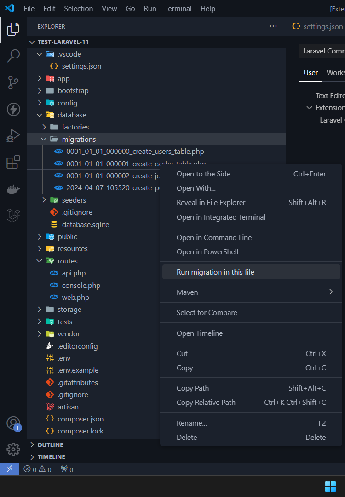

# Changelog

All notable changes to this project will be documented in this file.

## [0.0.3] - 2024-09-07
### Changed
- Renamed the project to `Laravel Command Suite`.

### Added
- Added categories for Composer commands:
  - **Basic**: Commands for managing Composer packages.
  - **Dependencies**: Commands for managing Composer dependencies.
  - **Project Management**: Commands for managing Composer project settings.
  - **Configuration**: Commands for managing Composer configuration.
  - **Scripts**: Commands for managing Composer scripts.
  - **Miscellaneous**: Miscellaneous Composer commands.
- Added settings to enable/disable the confirmation prompt when executing Artisan or Composer commands.
- Added the ability to run migration commands in the context menu when right-clicking on a file or folder in the Explorer view.
- 

 
 

## [0.0.2] - 2024-08-26

### Added
- Add Command Palette.

---

## [0.0.1] - 2024-08-26

### Added
- Initial release of Laravel Support Extension for VSCode.
- Integrated various Laravel Artisan commands into the VSCode sidebar.
- Added categories for Artisan commands:
  - **Make**: Commands for creating new Laravel components such as controllers, models, migrations, etc.
  - **Migrate & Database**: Commands for managing database migrations, seeding, and more.
  - **Misc**: Miscellaneous commands such as serving the application and listing routes.
- Implemented functionality to run Artisan commands in the integrated terminal.
- Added dynamic route list viewing:
  - Display route list in a new tab.
  - Added a refresh button to update the route list.

### Known Issues
- The extension only activates if a Laravel project with an `artisan` file is detected.
- The route list table formatting may need adjustments for different Laravel versions or custom routes.

### Future Enhancements
- Additional support for more Artisan commands.
- Improved error handling and user prompts.
- Enhanced UI/UX for the route list and other command outputs.

---

For more information, visit the [extension repository](https://github.com/ntkhang03/laravel-command-suite).
