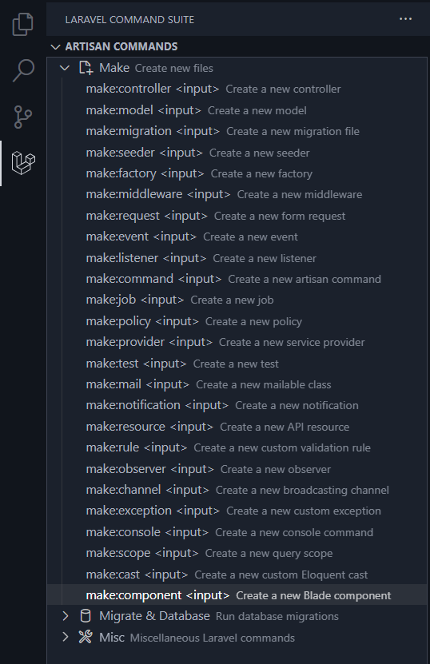
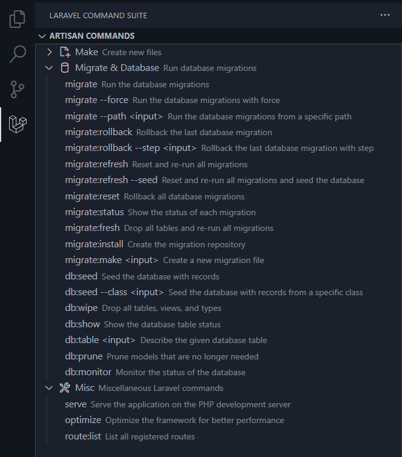

# Laravel Artisan Helper for VSCode

  
  <h2>💻 Unofficial Laravel extension for VSCode</h2>

## Introduction

Laravel Artisan Helper for Visual Studio Code provides a seamless experience when working with Laravel projects. It integrates many Laravel Artisan commands into VSCode, allowing you to run and manage commands directly from the activity bar. The extension supports many Artisan commands such as `make`, `migrate`, and `serve`, and provides a convenient user interface to interact with them.

## Features

- **Artisan Commands Integration**: Access and execute Laravel Artisan commands directly from the VSCode sidebar.
- **Dynamic Route List**: View and refresh the list of registered routes in a dedicated tab.
- **Terminal Integration**: Run Artisan commands in the integrated terminal with ease.

## List of Supported Commands
### Make

### Migrate & Database

## Installation

1. Open VSCode.
2. Navigate to the Extensions view by clicking on the Extensions icon in the Activity Bar on the side of the window.
3. Search for `Laravel Artisan Helper` and click `Install` to install the extension.

## Usage

### Activating the Extension

The extension is activated automatically when you open a Laravel project that contains the `artisan` file in its root directory. If your project is not a Laravel project, you will receive a warning message.

### Accessing Laravel Commands

Once activated, you will see a new "Laravel Tools" icon in the Activity Bar. Click on it to access various Laravel commands categorized into:

- **Make**: Commands for creating new Laravel components such as controllers, models, migrations, and more.
- **Migrate & Database**: Commands for managing database migrations and seeding.
- **Misc**: Miscellaneous Laravel commands like serving the application and listing routes.

### Running Artisan Commands

1. Click on the desired command in the sidebar.
2. If the command requires input (e.g., the name of a new controller), you will be prompted to enter the required information.
3. The command will be executed in the integrated terminal, and you can view the output directly in VSCode.

### Viewing Route List

1. Click on the "route:list" command under the Misc category.
2. A new tab will open displaying a table of registered routes.
3. Use the "Refresh" button to update the route list.

## Configuration

No additional configuration is required. The extension will automatically detect Laravel projects based on the presence of the `artisan` file.

## Contributing

Contributions are welcome! If you have suggestions or improvements, please open an issue or submit a pull request on the [GitHub repository](https://github.com/ntkhang03/laravel-artisan-helper).

## License

This extension is licensed under the [MIT License](LICENSE).

## Acknowledgments

- Laravel: A fantastic PHP framework that makes web development a breeze.
- VSCode: The best code editor that provides a rich development experience.

---

Feel free to reach out if you have any questions or need support. Happy coding!

